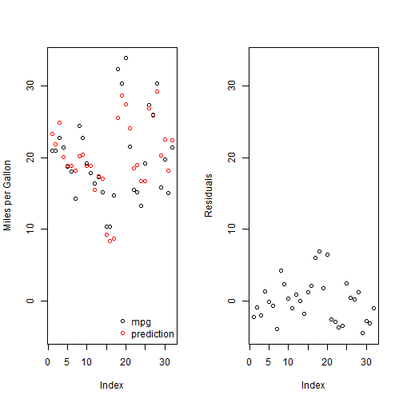
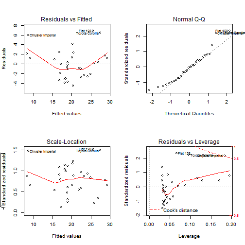

Prediction of the fuel consumption in the mtcars data set
========================================================
author: tomassve
date: Sunday, September 21, 2014

Why this app?
========================================================
You can interactively test the ability of different predictors to estimate the fuel consumption in miles per gallon.

There are 5 tabs in this app implementing a work flow. Starting with the *Data set* work the tabs from left to right and end up with a good predictor of *mpg*. The tabs are:

- Data set
- Pairs plot
- Prediction plot
- Model summary
- Diagnostic plots

Estimate fuel consumption from:
========================================================

- cyl
- disp
- hp
- drat
- wt

***

- qsec
- vs
- am
- gear

Powerful plots :-)
========================================================

 

Powerful diagnostics
========================================================

 

